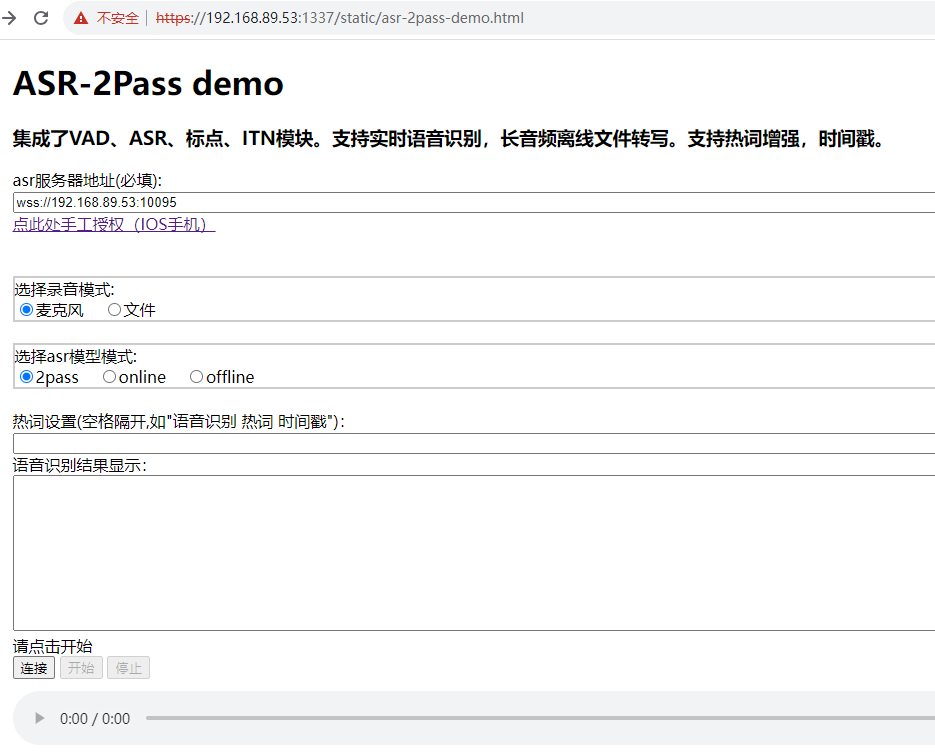
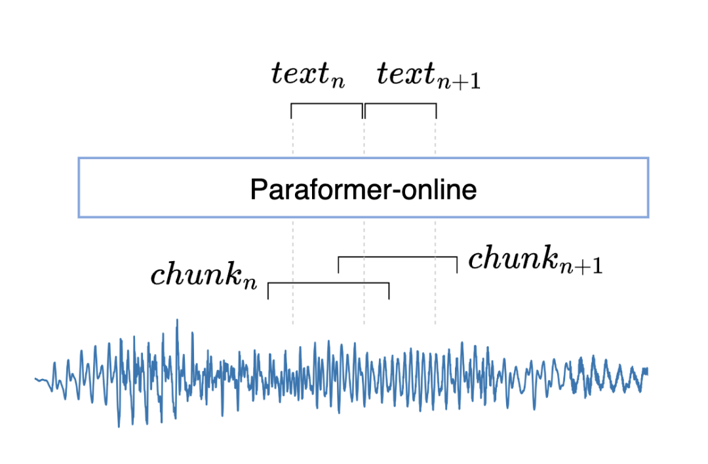

# 一、服务部署和使用

0, 首先克隆asr-2pass项目

1, 编译并启动服务
```shell
cd asr-2pass/websocket

# the following script will make websocket with onnxruntime when runing at first time. And the libs and models needed will be downloaded.
# the port is default: 10095, you can change it by yourself with "--port xxxxx".
bash ./run_server_2pass_ssl.sh --port 10095 &
```
不同服务启动脚本说明：
```text
a.流式ASR服务，适用于流式语音输入、长音频输入。输出视音频内容会分多个片段，最终结果返回时会服务端会给出特定标志。
  run_server_2pass_ssl.sh
    加载热词和时间戳版本非流式模型，流式标点模型(适用于多句文本拼接后显示，标点预测更准确)，ssl开启。默认端口10095

  run_server_2pass.sh
    加载热词和时间戳版本非流式模型，非流式标点模型(适用于单句文本上屏显示)，ssl关闭。默认端口10095

  run_server_2pass_svs.sh
    加载流式模型和SenseVoice模型，ssl关闭。默认端口10096
  
  
b.非流式ASR服务，适用于长音频转写。整段音频输入，一次输出完整ASR结果。
  run_server_offline.sh
    加载热词版本非流式模型，非流式标点模型，ssl关闭。默认端口10097
  
  run_server_offline_en.sh
    加载英文非流式模型，非流式中英通用标点大模型，不使用ITN，ssl关闭。默认端口10098
```


2, 启动h5服务（如果你想在浏览器上使用ASR）
```shell
cd ../html
# you should prepare a python env by yourself.
python h5Server.py  &
# the ip and port should be kept and used in the following step. the port is default: 1337
```
3, 浏览器中使用ASR服务，注意服务端需要启用ssl。

在浏览器中粘贴 "https://xxx.xxx.xx.xx:xxxx/static/asr-2pass-demo.html" 

把其中的ip和port号替换为上个步骤中得到的地址。如`https://192.168.89.53:1337/static/asr-2pass-demo.html`

ASR服务地址，填写第一步启动服务时的服务器地址和端口。如 `wss://192.168.89.53:10095`

启动后页面如下图所示：
<div align="left"></div>

4, 其他客户端，适合开发者，推荐python（随服务端更新）

见clients, 目前支持cpp, h5, java, python客户端。

以python客户端为例，支持以下参数控制：
```text
--host is the IP address of the FunASR runtime-SDK service deployment machine, which defaults to the local IP address (127.0.0.1). If the client and the service are not on the same server, it needs to be changed to the deployment machine IP address.
--port 10095 deployment port number
--mode: `offline` indicates that the inference mode is one-sentence recognition; `online` indicates that the inference mode is real-time speech recognition; `2pass` indicates real-time speech recognition, and offline models are used for error correction at the end of each sentence.
--chunk_size: indicates the latency configuration of the streaming model. [5,10,5] indicates that the current audio is 600ms, with a lookback of 300ms and a lookahead of 300ms.
--audio_in is the audio file that needs to be transcribed, supporting file paths and file list wav.scp
--thread_num sets the number of concurrent sending threads, default is 1
--ssl sets whether to enable SSL certificate verification, default is 1 to enable, and 0 to disable
--hotword: Hotword file path or hotwords split with space, one line for each hotword(e.g.: "语音识别 热词")
--use_itn: whether to use itn, the default value is 1 for enabling and 0 for disabling.
--vad_tail_sil: the trailing silence length of VAD, in ms. If silence in an audio cilp exceed this value, it will be cut.
--vad_max_len: the max duration of a audio segment cut by VAD, in ms. If there is no silence deteced, the audio will be cut when its duration exceed this value.
```

5, 服务端参数配置
```text
--download-model-dir 模型根目录
--model-dir  非流式识别ASR模型路径
--online-model-dir  流式识别ASR模型路径
--quantize  True为量化ASR模型，False为非量化ASR模型，默认是True
--vad-dir  VAD模型路径
--vad-quant   True为量化VAD模型，False为非量化VAD模型，默认是True
--punc-dir  标点模型路径
--punc-quant   True为量化PUNC模型，False为非量化PUNC模型，默认是True
--itn-model-dir 文本反正则模型的路径
--port  服务端监听的端口号，默认为 10095
--decoder-thread-num  服务端启动的推理线程数，默认为 8，可配置为核数，或者核数的2倍。
--io-thread-num  服务端启动的IO线程数，默认为 1，可以配置为核数的1/4。
--certfile  ssl的证书文件，默认为：../../../ssl_key/server.crt，如需关闭，设置为""
--keyfile   ssl的密钥文件，默认为：../../../ssl_key/server.key，如需关闭，设置为""

```


# 二、websocket通信协议

## 实时语音识别
### 系统架构图

<div align="left"></div>

### 从客户端往服务端发送数据
#### 消息格式
配置参数与meta信息用json，音频数据采用bytes

#### 首次通信
message为（需要用json序列化）：
```text
{"mode": "2pass", "wav_name": "wav_name", "is_speaking": True, "wav_format":"pcm", "chunk_size":[5,10,5], "audio_fs": 16000}
```
参数介绍：
```text
`mode`：`offline`，表示推理模式为一句话识别；`online`，表示推理模式为实时语音识别；`2pass`：表示为实时语音识别，并且说话句尾采用离线模型进行纠错。
`wav_name`：表示需要推理音频文件名
`wav_format`：表示音视频文件后缀名，可选pcm、mp3、mp4等（备注，1.0版本只支持pcm音频流）
`is_speaking`：表示断句尾点，例如，vad切割点，或者一条wav结束
`chunk_size`：表示流式模型latency配置，`[5,10,5]`，表示当前音频为600ms，并且回看300ms，后看300ms。chunk中心越大性能越好，但是时延也越高。
`audio_fs`：当输入音频为pcm数据是时，需要加上音频采样率参数
```

#### 发送音频数据
直接将音频数据，移除头部信息后的bytes数据发送，支持音频采样率为8000（`message`中需要指定`audio_fs`为8000），16000
#### 发送结束标志
音频数据发送结束后，需要发送结束标志（需要用json序列化）：
```text
{"is_speaking": False}
```
### 从服务端往客户端发数据
#### 发送识别结果
message为（采用json序列化）
```text
{"mode": "2pass-online", "wav_name": "wav_name", "text": "asr ouputs", "is_final": True}
```
参数介绍：
```text
`mode`：表示推理模式，分为`2pass-online`，表示实时识别结果；`2pass-offline`，表示2遍修正识别结果
`wav_name`：表示需要推理音频文件名
`text`：表示语音识别输出文本
`is_final`：表示识别结束
`timestamp`：如果AM为时间戳模型，会返回此字段，表示时间戳，格式为 "[[100,200], [200,500]]"(ms)
```
输入音频chunk和输出文本的示意图如下：
<div align="left"></div>


## 离线文件转写
### 从客户端往服务端发送数据
#### 消息格式
配置参数与meta信息用json，音频数据采用bytes
#### 首次通信
message为（需要用json序列化）：
```text
{"mode": "offline", "wav_name": "wav_name","wav_format":"pcm","is_speaking": True,"wav_format":"pcm","hotwords":"阿里巴巴 达摩院 阿里云"}
```
参数介绍：
```text
`mode`：`offline`，表示推理模式为离线文件转写
`wav_name`：表示需要推理音频文件名
`wav_format`：表示音视频文件后缀名，可选pcm、mp3、mp4等
`is_speaking`：False 表示断句尾点，例如，vad切割点，或者一条wav结束
`audio_fs`：当输入音频为pcm数据是，需要加上音频采样率参数
`hotwords`：如果AM为热词模型，需要向服务端发送热词数据，格式为字符串，热词之间用" "分隔，例如 "语音识别 热词 时间戳"
```

#### 发送音频数据
pcm直接将音频数据，其他格式音频数据，连同头部信息与音视频bytes数据发送，支持多种采样率与音视频格式

#### 发送音频结束标志
音频数据发送结束后，需要发送结束标志（需要用json序列化）：
```text
{"is_speaking": False}
```

### 从服务端往客户端发数据
#### 发送识别结果
message为（采用json序列化）
```text
{"mode": "offline", "wav_name": "wav_name", "text": "asr ouputs", "is_final": True,"timestamp":"[[100,200], [200,500]]"}
```
参数介绍：
```text
`mode`：`offline`，表示推理模式为离线文件转写
`wav_name`：表示需要推理音频文件名
`text`：表示语音识别输出文本
`is_final`：表示识别结束
`timestamp`：如果AM为时间戳模型，会返回此字段，表示时间戳，格式为 "[[100,200], [200,500]]"(ms)
```


# 三、便捷转写教程

1. 启动服务，第一次启动时会自动编译
```shell
bash ./run_prepare_server.sh
```

2. 在另一个窗口，启动转写
```shell
audio_dir=/path/to/your/audios  # 这里需要提供转写音频所在的文件夹，绝对路径。
bash ./run_transcribe_audio.sh $audio_dir
```


# 四、数据切分，转写，筛选流程
```shell
src_dir=/path/to/your/src/audio/  # 原始需要清洗的长音频/长视频所在路径
tgt_dir=/path/to/your/tgt/audio   # 最终清洗后的短音频和文本等kaldi格式数据保存路径
bash ./run_seg_asr_filter1.sh  $src_dir  $tgt_dir 
```
